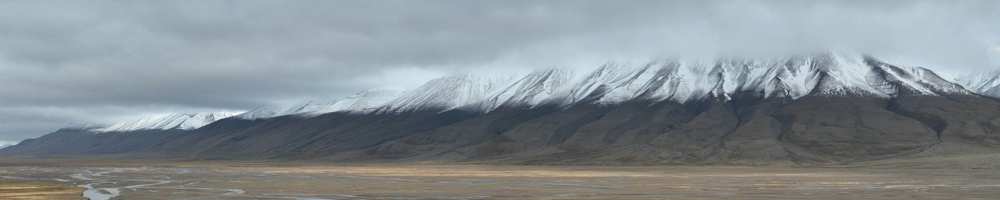

# SentinelSnowmelt

The objective of this project is to map the timing of snowmelt in spring for the Adventdalen valley in Svalbard with Sentinel-2 time series data.

**Background and motivation**

Snow is a typical feature in Arctic Tundra ecosystems that essentially governs environmental processes including surface energy balance, nutrient and water availability for soil, plant and animal communities. In addition, the latter one has a major effect on the timing of plant phenological phases. In Tundra ecosystems, the timing of snowmelt marks the start of the growing season. Its spatial distribution is mainly depending on wind conditions and temperature during springtime next to topography (Frei a. Henry, 2022). Therefore, the timing of snowmelt is considered as an important indicator of climate change and ecosystem state (Stendardi et al. 2022). This work makes use of the Sentinel-2 satellite data archive in the Google Earth Engine to map the timing of snowmelt in an Arctic Tundra environment by applying a threshold-ruled approach to Normalised Differenced Snow Index (NDSI) time series.

**Study Area**

The Adventdalen valley is located at approximately 78° N in the Western center of the Svalbard archipelago. The main town Longyearbyen is located next to the Adventfjord marking the entry of the valley. The periglacial landscape is structured by high plateaux and wide glacial valleys and alluvial plains. The valley lies within the Middle Arctic zone with a arctic-tundra climate (Stendardi et al. 2022).

**Data and methods**

To detect the timing of snowmelt, multi-spectral data acquired by the Sentinel-2 satellites between 2016 and 2023 are accessed via the Earth Engine Python API. In this study, Top-of-Atmosphere (TOA) reflectance data was used as it is available before 2017 and to ensure consistency when making comparisons between the different years.
For each year, the available image data with a maximum cloud cover of 20% between April and August was used. 

To enhance the information content in regard to snow cover, the NDSI was computed. The Normalised Differenced Water Index (NDWI) was calculated to exclude the Fjord area in the North-West of the study region. The timing of snowmelt was considered to be occurred when the NDSI remains below 0.4 for two consecutive acquisitions. This rule was applied to each pixel of the image to produce a map of the spatial distribution of the day-of-the-year (DOY) of complete snowmelt.

**References**

Frei, E.R., G.H.R. Henry (2022): Long-term effects of snowmelt timing and climate warming on phenology, growth, and reproductive effort of Arctic tundra plant species. Arctic Science 8: 700–721. dx.doi.org/10.1139/as-2021-0028

Stendardi, L., Karlsen, S.R., Malnes, E.,.., C. Notarnicola (2022): Multi-Sensor Analysis of Snow Seasonality and a Preliminary Assessment of SAR Backscatter Sensitivity to Arctic Vegetation: Limits and Capabilities. Remote Sensing, 14(8). 1866; https://doi.org/10.3390/rs14081866

